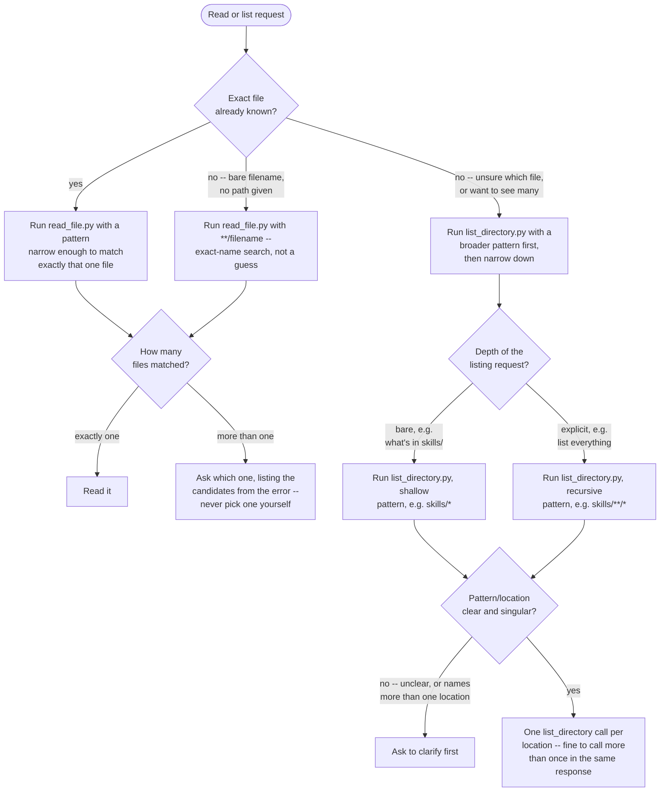
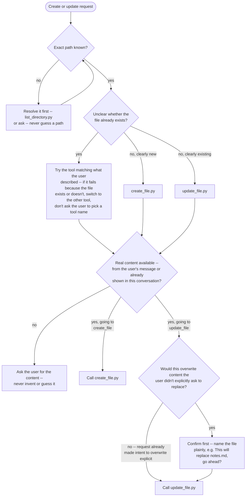
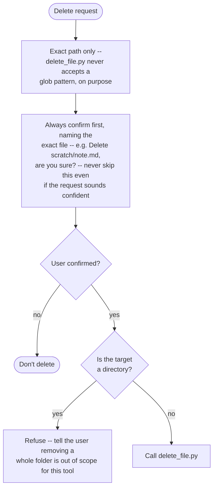

# File Operations (flowchart variant)

## Instructions

### Reading and listing

### Creating and updating

### Deleting

### Notes that don't fit as graph nodes

- If the path or pattern the user gave is unclear or ambiguous for any
  other reason not covered above, don't guess -- ask.
- Never try to work around a refusal from any of these scripts (e.g. by
  rewriting the path to escape the project) -- all of them refuse paths
  that leave the project root on purpose; tell the user it's out of scope.

## Errors

`scripts/read_file.py` fails in exactly these ways -- react to each differently, don't
just apologize generically:

- **no match** (`no file matches pattern: <pattern>`) -- the pattern found nothing. Suggest
  `scripts/list_directory.py` with a broader pattern to see what's actually there, or ask
  the user to clarify the path.
- **ambiguous match** (`pattern matches N files, expected exactly one: ...`) -- the pattern
  found more than one file. Ask which one, listing the candidates, rather than picking one
  yourself, even if it looks obvious.
- **not a file** (`matched path is a directory, not a file: <path>`) -- the pattern matched
  a directory, not a file. Use `scripts/list_directory.py` on that directory instead, or
  ask the user for a specific file within it.
- **outside project** (`pattern resolves outside the project root: <pattern>`) -- refuse to
  retry with a workaround; tell the user this is out of scope.
- **unreadable** (`could not read <path>: <reason>`) -- a real I/O problem (bad encoding,
  permissions). Report it plainly; don't retry silently.

`scripts/list_directory.py` fails in these ways:

- **no match** (`nothing matches pattern: <pattern>`) -- not treated as an error; it
  prints an empty-result message and exits normally. Suggest a broader pattern to the
  user.
- **too many matches** -- it lists up to 200 and tells you how many more were truncated.
  Ask the user to narrow the pattern rather than trying to read everything it found.
- **outside project** -- same refusal as `read_file.py`, same reasoning.
- **unclear or multi-location pattern** -- not something the script detects (it only ever
  takes one pattern per call); catch this before calling it at all. See Instructions.

`scripts/create_file.py` fails in these ways:

- **already exists** (`file already exists: <path> -- use update_file to modify it`) --
  switch to `update_file` (after confirming the overwrite is wanted) instead of retrying
  create.
- **missing parent directory** (`parent directory does not exist: <dir>`) -- the folder
  the file would live in doesn't exist yet. Tell the user; this tool won't create
  directory structure on its own.
- **outside project** -- same refusal as above.
- **write failed** (`could not write <path>: <reason>`) -- a real I/O problem. Report it
  plainly.

`scripts/update_file.py` fails in these ways:

- **does not exist** (`file does not exist: <path> -- use create_file to make it first`)
  -- switch to `create_file` instead of retrying update.
- **not a file** (`path is a directory, not a file: <path>`) -- can't overwrite a
  directory. Tell the user.
- **outside project** -- same refusal as above.
- **write failed** (`could not write <path>: <reason>`) -- a real I/O problem. Report it
  plainly.

`scripts/delete_file.py` fails in these ways:

- **does not exist** (`file does not exist: <path>`) -- nothing to delete; tell the
  user, don't retry.
- **is a directory** (`will not delete a directory: <path>`) -- out of scope for this
  tool; tell the user.
- **outside project** -- same refusal as above.
- **delete failed** (`could not delete <path>: <reason>`) -- a real I/O problem
  (e.g. permissions). Report it plainly.

## Tools

Run these with the Bash tool, e.g. `uv run scripts/read_file.py --pattern "..."`
(or plain `python scripts/read_file.py --pattern "..."` if `uv` isn't available).

- `scripts/read_file.py` -- reads exactly one file's content, given a pattern narrow
  enough to match just that one file.
- `scripts/list_directory.py` -- lists every file and folder matching a broader glob
  pattern (capped at 200 results); folders are marked with a trailing `/`.
- `scripts/create_file.py` -- creates a new file with given content at an exact path;
  refuses if the file already exists.
- `scripts/update_file.py` -- overwrites an existing file's full content at an exact
  path; refuses if the file doesn't exist.
- `scripts/delete_file.py` -- deletes exactly one existing file at an exact path; never
  accepts a pattern, never deletes a directory.
