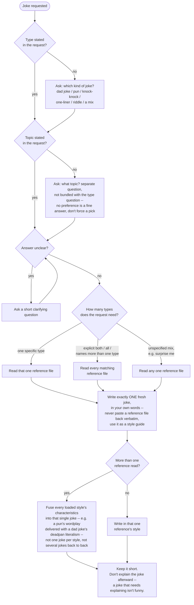

# Tell Joke (flowchart variant)

## Instructions

Notes that don't fit as graph nodes:

- If the user already stated the type and/or topic in their request, that
  answers the `TypeGiven`/`TopicGiven` checks directly -- don't ask again
  for whichever part they already gave.

## References

- `references/dad-joke.md` -- dad joke
- `references/pun-joke.md` -- pun
- `references/knock-knock.md` -- knock-knock joke
- `references/one-liner.md` -- one-liner / observational joke
- `references/riddle.md` -- riddle
