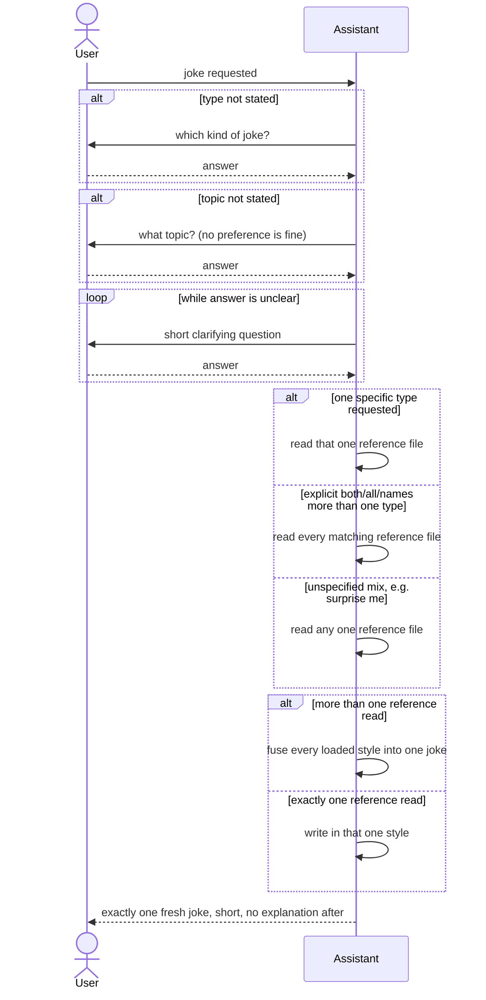

# Tell Joke (sequence diagram variant)

## Instructions

Notes that don't fit as graph nodes:

- Each `Assistant->>User` question above is its own separate question
  (never bundled into another), and never paste a loaded reference back
  verbatim -- use it as a style guide to write a fresh joke.
- If the user already stated the type and/or topic in their request, skip
  straight past that `alt` block -- don't ask again for what's already given.

## References

- `references/dad-joke.md` -- dad joke
- `references/pun-joke.md` -- pun
- `references/knock-knock.md` -- knock-knock joke
- `references/one-liner.md` -- one-liner / observational joke
- `references/riddle.md` -- riddle
