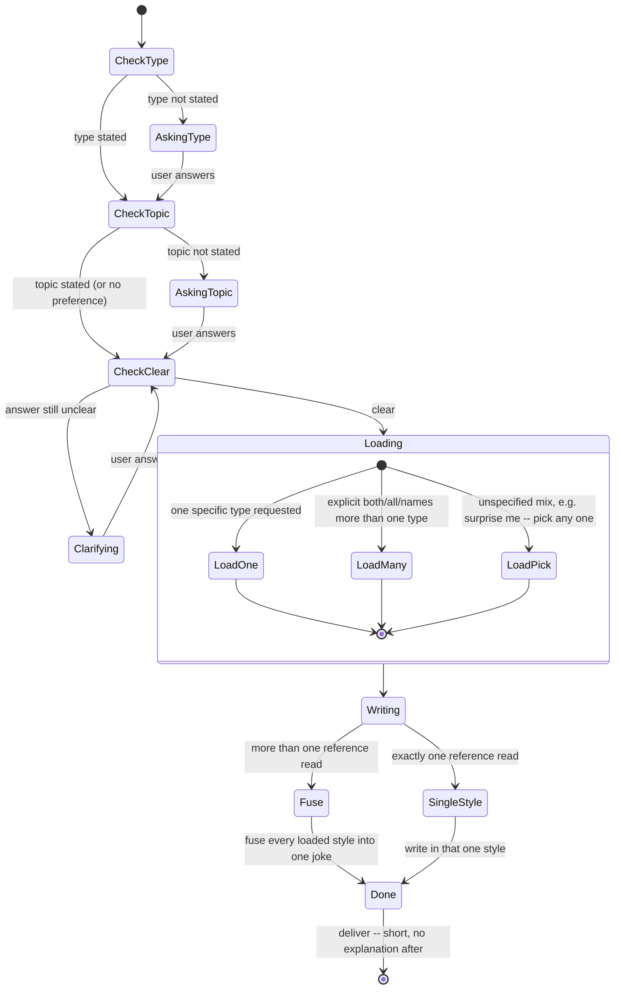

# Tell Joke (state diagram variant)

## Instructions

Notes that don't fit as graph nodes:

- Each question above ("which kind of joke", "what topic") should be its
  own separate question, never bundled -- and never paste a reference
  file back verbatim, use it as a style guide to write a fresh joke.
- "AskingType"/"AskingTopic" only fire when that part is genuinely missing
  from the request -- if the user already stated it, go straight to
  `CheckTopic`/`CheckClear`.

## References

- `references/dad-joke.md` -- dad joke
- `references/pun-joke.md` -- pun
- `references/knock-knock.md` -- knock-knock joke
- `references/one-liner.md` -- one-liner / observational joke
- `references/riddle.md` -- riddle
