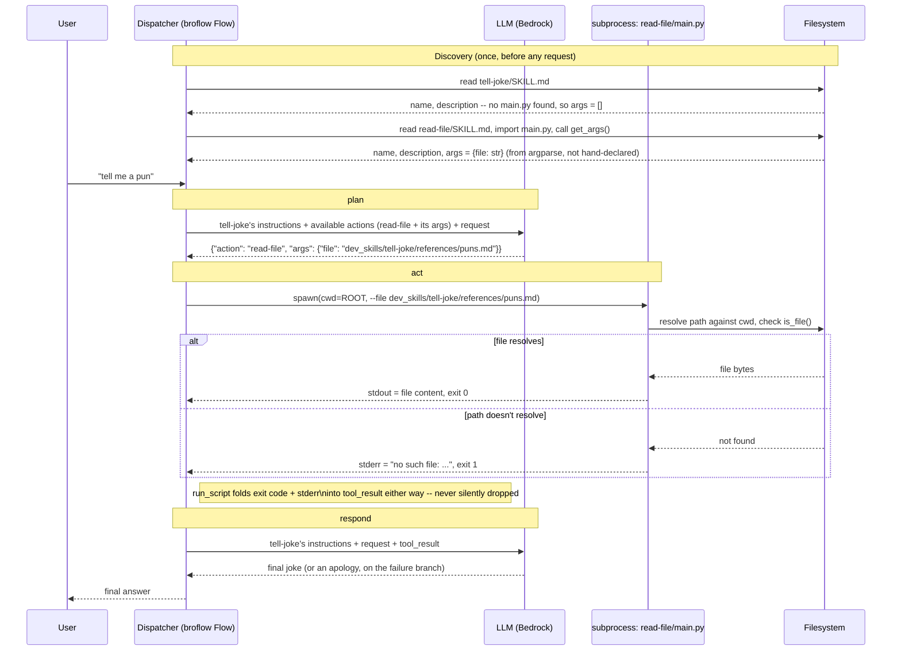

```mermaid
sequenceDiagram
participant U as User
participant D as Dispatcher (broflow Flow)
participant L as LLM (Bedrock)
participant P as subprocess: read-file/main.py
participant FS as Filesystem

    Note over D,FS: Discovery (once, before any request)
    D->>FS: read tell-joke/SKILL.md
    FS-->>D: name, description -- no main.py found, so args = []
    D->>FS: read read-file/SKILL.md, import main.py, call get_args()
    FS-->>D: name, description, args = {file: str} (from argparse, not hand-declared)

    U->>D: "tell me a pun"

    Note over D,L: plan
    D->>L: tell-joke's instructions + available actions (read-file + its args) + request
    L-->>D: {"action": "read-file", "args": {"file": "dev_skills/tell-joke/references/puns.md"}}

    Note over D,P: act
    D->>P: spawn(cwd=ROOT, --file dev_skills/tell-joke/references/puns.md)
    P->>FS: resolve path against cwd, check is_file()
    alt file resolves
        FS-->>P: file bytes
        P-->>D: stdout = file content, exit 0
    else path doesn't resolve
        FS-->>P: not found
        P-->>D: stderr = "no such file: ...", exit 1
    end
    Note right of D: run_script folds exit code + stderr\ninto tool_result either way -- never silently dropped

    Note over D,L: respond
    D->>L: tell-joke's instructions + request + tool_result
    L-->>D: final joke (or an apology, on the failure branch)

    D-->>U: final answer
```
