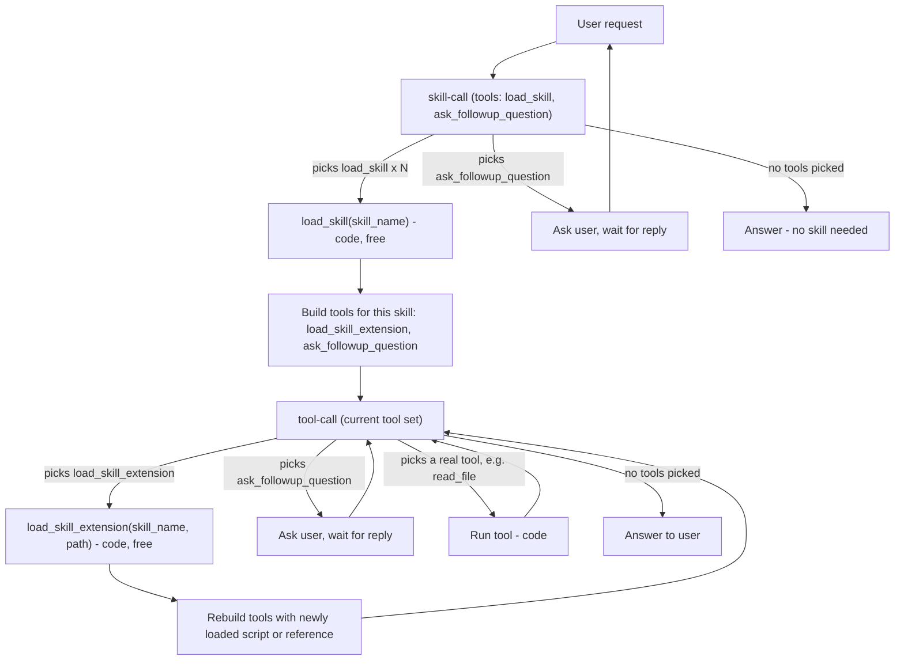

```mermaid
flowchart TD
    A[User request] --> B["skill-call (tools: load_skill, ask_followup_question)"]
    B -->|picks load_skill x N| C["load_skill(skill_name) - code, free"]
    B -->|picks ask_followup_question| Q1[Ask user, wait for reply] --> A
    B -->|no tools picked| E1[Answer - no skill needed]

    C --> D["Build tools for this skill: load_skill_extension, ask_followup_question"]
    D --> T["tool-call (current tool set)"]

    T -->|picks load_skill_extension| L["load_skill_extension(skill_name, path) - code, free"]
    L --> D2[Rebuild tools with newly loaded script or reference]
    D2 --> T

    T -->|picks ask_followup_question| Q2[Ask user, wait for reply] --> T

    T -->|picks a real tool, e.g. read_file| X[Run tool - code]
    X --> T

    T -->|no tools picked| F[Answer to user]

```
