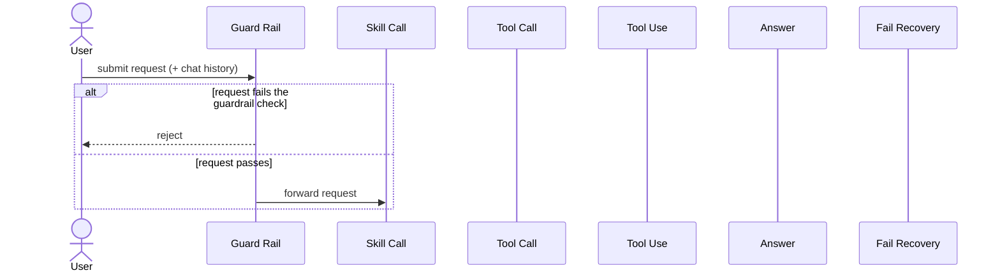
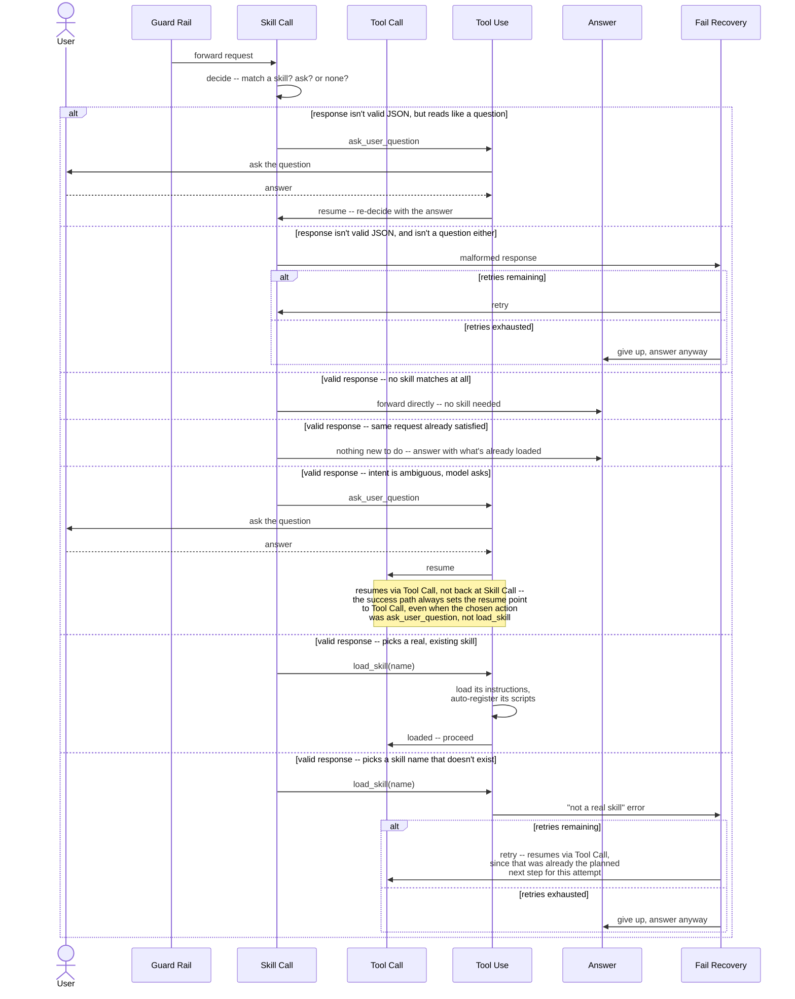
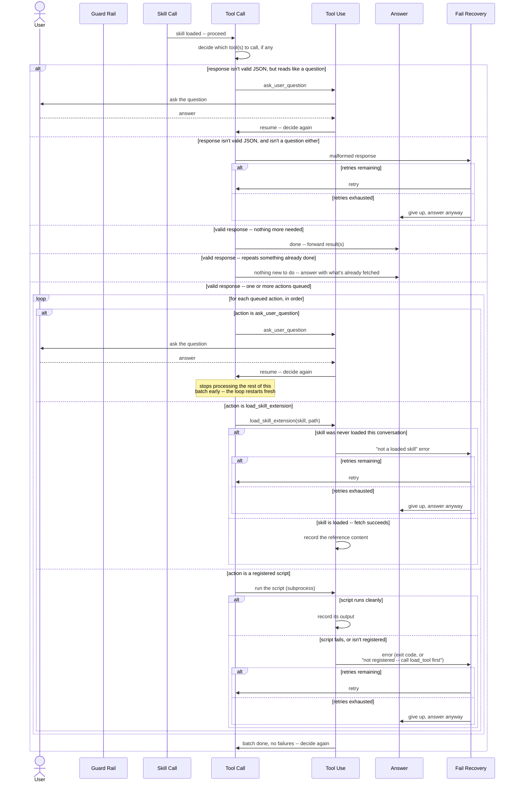
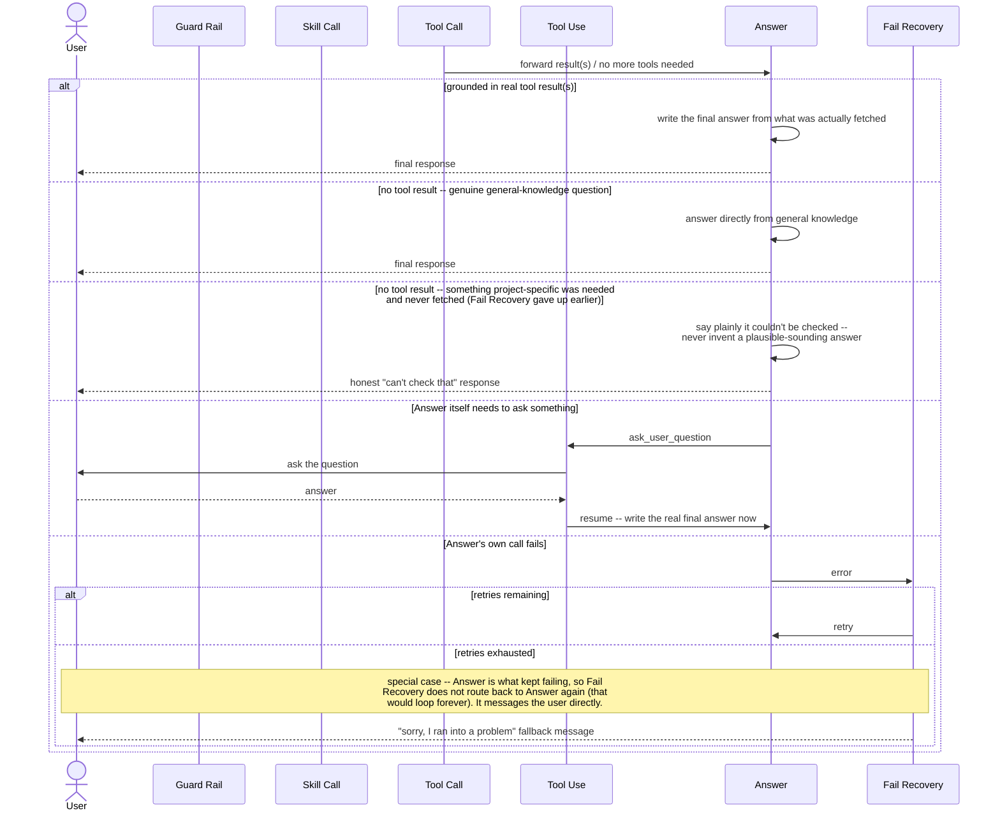

# broharness — request flow (v2, scenario-by-scenario)

Same idea as v1, broken into smaller scenarios per your request, each
covering every real branch in that part of the flow as exhaustively as
possible. `Fail Recovery` is now included — it's load-bearing in practice,
not an edge case (it fired in nearly every real test run this session).

**`Guard Rail` is still a proposed addition, not yet implemented** in
`src/broharness/flows/`. Everything else below is read directly from the
current source (`skill_call.py`, `tool_call.py`, `tool_use.py`,
`answer.py`, `fail_recovery.py`).

Every diagram declares the same participants, in the same order:
`User`, `Guard Rail`, `Skill Call`, `Tool Call`, `Tool Use`, `Answer`,
`Fail Recovery` — even where a scenario doesn't exercise all of them, for
easy side-by-side comparison.

## Scenario 1 — request vs. Guard Rail

## Scenario 2 — Skill Call

**Worth knowing:** the "intent is ambiguous, model asks" branch and the
"picks a skill name that doesn't exist" branch both resume via `Tool Call`
after recovering, not back at `Skill Call`. That's correct for the second
case (loading was already the planned next step), but the first case means
a clarification the model asked *to help pick a skill* gets answered inside
`Tool Call`'s context, not re-run through `Skill Call`'s own matching logic
— a real asymmetry in the current code, not a diagramming simplification.

## Scenario 3 — Tool Call ↔ Tool Use

**Not drawn separately, to keep this readable:** `load_skill` (re-loading
a different skill mid-batch) and `load_tool` (the rare manual-registration
fallback, superseded by auto-registration) can also appear in a queued
batch. Both follow the same two-way shape as the branches above — success
continues the batch, failure reports to `Fail Recovery` with the same
bounded-retry/give-up pattern.

## Scenario 4 — Tool Call done → Answer

