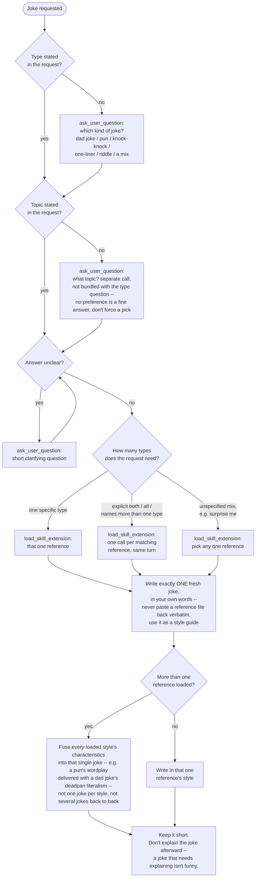
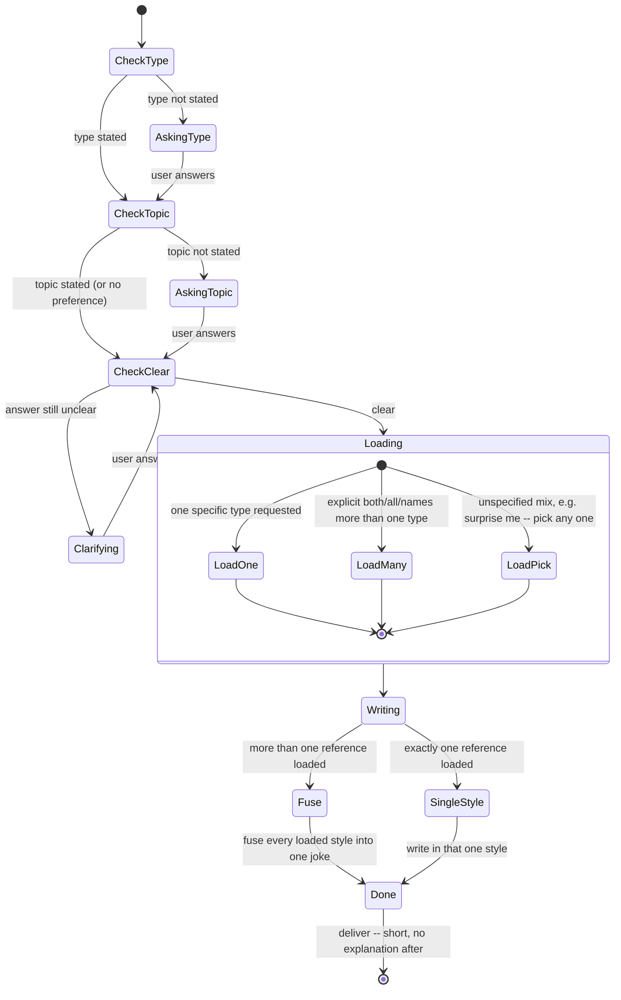
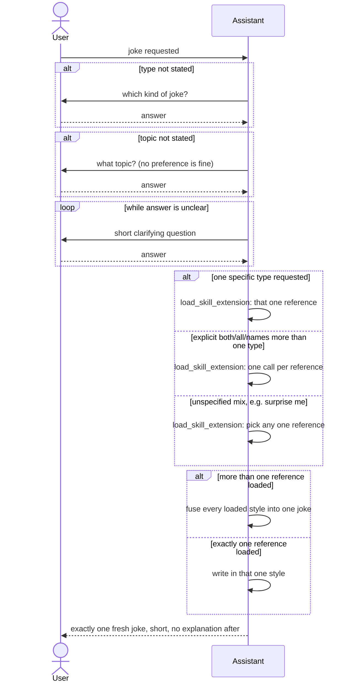

# Diagram-as-prompt mockups — tell-joke, three ways

Same `tell-joke` logic (the live `SKILL.md`'s current flowchart), redrawn
as a state diagram and a sequence diagram, so the three can be compared
side by side before picking one to actually test. **Nothing here is live**
-- this is a review document, not a skill.

## 1. Flowchart (what's already live in `SKILL.md`)

**Syntax notes:** `flowchart TD` (top-down). Rounded `([...])` for
start/end, diamond `{...}` for a yes/no or multi-way question, rectangle
`[...]` for an action/instruction. Branches are labeled edges
(`-->|label|`). Reads as "what do I check, what do I do" -- closest to how
the prose instructions were already structured (one bullet per decision).

## 2. State diagram

**Syntax notes:** `stateDiagram-v2`. `[*]` is the start/end pseudostate.
`state X <<choice>>` marks a decision point (same role as a flowchart
diamond, drawn as a small diamond node). `state Loading { ... }` is a
*composite state* -- a sub-machine nested inside one named state, used
here to group the three loading variants without flattening them into the
top-level flow. Edges carry the triggering event as a label
(`A --> B: event`), not a question -- the diagram describes what the
*system's situation* is at each point ("AskingType", "Loading"), not just
what to check next.

## 3. Sequence diagram

**Syntax notes:** `sequenceDiagram`. Two lanes only (`User`, `Assistant`)
-- no third party exists in this skill's own logic, so no extra
participant was added just to fill the format. `->>`/`-->>` are
message arrows (solid = request, dashed = reply); a self-arrow
(`Assistant->>Assistant`) represents an internal decision with no real
back-and-forth. `alt`/`else`/`end` for branches, `loop`/`end` for the
repeat-until-clear step. Reads as a *conversation transcript* -- turn by
turn -- rather than a map of decisions.

## At a glance

| | Reads most like... | Where it's weakest |
|---|---|---|
| Flowchart | A checklist: "check this, then do that" | Doesn't show *who* is being talked to at each step -- `ask_user_question` is just another box |
| State diagram | "What situation am I in right now" | The choice/composite-state vocabulary (`<<choice>>`, nested `state {}`) is the least self-explanatory of the three at a glance |
| Sequence diagram | A back-and-forth transcript with the user | Internal decisions (which reference(s) to load, whether to fuse) have to be drawn as self-arrows, which reads oddly for something that isn't really a "message" |
