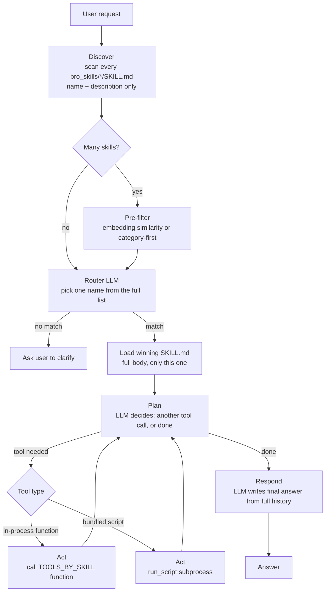

# study-on-agent

A small hands-on study of how agent "skills" work — modeled on how Claude Code
loads and runs skills — built from scratch with two libraries:
[`broflow`](https://pypi.org/project/broflow/) (task/flow orchestration) and
[`brollm`](https://pypi.org/project/brollm/) (a thin, provider-agnostic LLM
call contract).

## Repo layout

```
bro_skills/       one folder per skill, each holding a SKILL.md
src/bro_agent/    shared plumbing (skill loading, LLM calls, the plan/act/
                  respond loop, lead persistence, the funnel flow) --
                  imported by both notebooks instead of copy-pasted
notebooks/        dev.ipynb          -- the core mechanism, one request at a time
                  sales_agent.ipynb  -- a multi-turn, stage-gated funnel built on it
data/             generated SQLite lead store (gitignored)
```

## What a skill is

A skill is **instructions, not code**: a folder containing a `SKILL.md` with
YAML frontmatter (`name`, `description`) followed by a free-form body telling
an agent what to do when the skill is invoked.

```
---
name: grep-file
description: Search for a text pattern inside a specific file and return
  matching lines with their line numbers. Use this when the user names a
  file and a pattern/word/string to find within it.
---

# Grep File

When invoked, you have access to two tools: `read_file(path)` and
`grep_file(pattern, path)`.
...
```

The `description` field matters more than anything else in the file — it's
the only thing read during discovery, and it's what a routing model reasons
over when deciding whether to trigger the skill. A vague description means a
skill that never gets picked, or gets picked for the wrong request.

## The four stages, as built in `notebooks/dev.ipynb`

### 1. Discovery — cheap, for every skill

Scan every `bro_skills/*/SKILL.md` and parse *only* the frontmatter. This
mirrors the skill listing Claude Code puts in its own system prompt: a flat
`{name: description}` map, built for all skills regardless of whether any of
them end up used.

### 2. Routing — a model picks, not a keyword match

Hand every `(name, description)` pair plus the user's request to an LLM and
ask it to reply with a single skill name. This is a real inference call
(here, through `brollm.BaseContract` calling AWS Bedrock, model
`google.gemma-3-4b-it` in `us-east-1`) — routing is a judgment call the model
makes, not string matching or embedding similarity.

### 3. Load — full body, only for the winner

Once a name is chosen, read that one `SKILL.md`'s full body. Every other
skill stays as just a description — this is the "progressive disclosure"
part: instructions are loaded lazily, not for every skill up front.

### 4. Execute — a plan / act / respond loop

A skill's instructions alone don't do anything; an agent has to *act* on
them. This is modeled as a three-step `broflow.Flow`:

- **`plan`** — given the skill's instructions and the user's request, ask
  the model which tool call (if any) would satisfy it. The model replies
  with a fenced ` ```json ` block (parsed via `brollm.extract_codeblocks`),
  e.g. `{"tool": "grep_file", "args": {"pattern": "...", "path": "..."}}`,
  or `{"tool": null}` if no tool is needed.
- **`act`** — actually call that function from a small `TOOLS` registry
  (`read_file`, `grep_file`) in the kernel. This is the only step that
  touches the filesystem.
- **`respond`** — feed the tool's result (if any) back to the model so it
  writes the final answer, following the skill's instructions.

`plan` decides its own next step (`act` if a tool is needed, straight to
`respond` if not) — that's `broflow`'s whole design: a task never holds a
reference to what comes next, it just names it, so `hello-world` (no tools)
and `grep-file` (needs `grep_file`) both run through the exact same flow.

### Two kinds of tools: in-process functions vs. bundled scripts

`act` can reach a tool two different ways, and they behave very differently:

- **`TOOLS`** (`read_file`, `grep_file`) — plain Python functions living in
  the notebook's own process. Called directly, in-process.
- **`run_script`** — for a skill that bundles its own executable file (e.g.
  `word-count/count_words.py`, sitting right next to its `SKILL.md`). It's
  run as a real **subprocess** (`sys.executable script.py arg1 arg2 ...`,
  always as an argument list, never `shell=True`) and only its stdout/stderr
  comes back — the script's source is never read into the model's context at
  all. This is how Claude Code itself runs a skill's bundled scripts: they
  aren't imported, they're executed and their output is read back as text.
  `build_plan_prompt` lists whatever `*.py` files sit in a skill's folder so
  the model knows `run_script` is available and what it can call.

Both kinds of tool paths follow the same convention: relative path
arguments are resolved against `REPO_ROOT`, so the model can consistently
say `bro_skills/word-count/sample.txt` regardless of which tool it's using.

#### Which one is better?

Neither, in general — they trade off differently, and the right call
depends on the job.

**In-process functions (`TOOLS`)**
- *Pros*: zero call overhead (direct function call, no process spawn); can
  share live state with the rest of the kernel (a loaded dataframe, an open
  connection, anything already in memory); trivial to debug — exceptions
  show up in a normal traceback, same process.
- *Cons*: must be written in the host runtime (Python here); a bug, hang, or
  infinite loop inside the function can take the whole kernel down with it;
  every registered tool needs its name/signature declared to the model, so
  token cost grows with how many tools exist.

**Bundled scripts (`run_script`, subprocess)**
- *Pros*: real isolation — a crash, hang, or runaway resource use in the
  script can't touch the kernel; can be written in any language/runtime, not
  just Python, and can carry its own dependencies without polluting the main
  environment; genuinely portable — the script can be run from a plain
  terminal with zero agent involved, so it's independently testable and
  reusable outside the agent entirely; the interface is documented once in
  `SKILL.md` and loaded lazily (only when that skill is chosen), rather than
  declared as a schema on every call, so it scales better as skill count
  grows.
- *Cons*: process-spawn overhead on every call; no shared memory, so
  anything passed in or out has to go through args/files/stdout — awkward
  for rich objects; errors come back as exit codes/stderr instead of a live
  traceback, which is more opaque to debug.

**Heuristic**: reach for an in-process function when the operation is
small, fast, trusted, and needs to touch state already live in the session.
Reach for a bundled script when the operation is heavier, slower, less
trusted, needs a different runtime or its own dependencies, or is useful as
a standalone thing outside the agent entirely. This is roughly what Claude
Code itself does: most real skill work goes through Bash-run scripts for
the isolation/portability, while a few tightly-coupled things that must
stay in lockstep with the harness's own state stay as native tool calls.

**More examples, sorted by which side they fit:**

| Use case | Fits | Why |
|---|---|---|
| Look up a value already loaded in memory (a dict, a dataframe) | in-process | No I/O at all; a subprocess couldn't see that memory anyway |
| Validate/reformat a string, do small arithmetic, filter a list | in-process | Sub-millisecond, pure, no reason to pay spawn overhead |
| Call another library already imported in the kernel (e.g. a vector store client held open) | in-process | Needs the live connection object, not a fresh process |
| Run a linter/formatter (`ruff`, `black`) over a file | script | Already a real CLI tool; wrapping it as a script instead of reimplementing it in Python is strictly less work |
| Run a data pipeline needing `pandas`/`torch`/`polars` | script | Keeps heavy, possibly conflicting dependencies out of the main kernel's env; can even use its own venv |
| Anything that shells out to `git`, `curl`, a compiler, or another CLI | script | It's already a subprocess call underneath; no point hiding that behind an in-process wrapper |
| An operation that might hang or run long (a slow scrape, a big file transform) | script | Isolation means a timeout/kill doesn't risk the whole kernel |
| Something a teammate should be able to run by hand, outside any agent | script | Scripts are inherently a portable CLI; an in-process function isn't runnable without the kernel around it |
| A capability written in another language (a Node script, a compiled Go binary, a shell one-liner) | script | Only scripts can cross the runtime boundary at all |
| Something that mutates fragile in-memory session state (e.g. incrementing a counter object other tools also touch) | in-process | A subprocess can't see or safely mutate that shared object |

## Scaling up: many skills, many tools

Everything above works cleanly at 2-3 skills. Three things in this design
stop scaling gracefully once the skill count grows, and none of them are
implemented in this repo yet — they're the natural next step.

**1. The router prompt is flat and grows with every skill.** `build_router_prompt`
puts *every* `(name, description)` pair into one LLM call. At 5 skills that's
free. At 200 skills, that's a lot of tokens on every single request, and
routing accuracy tends to degrade too — a small/fast model has a harder time
picking the right one out of a long flat list than a short one. The fix is a
cheap pre-filter before the routing call ever happens: either (a) embedding
similarity between the request and every description, keeping only the
top-K candidates for the LLM to choose among, or (b) grouping skills into
categories (`bro_skills/<category>/<skill>/SKILL.md`) and routing in two
hops — pick the category first, then the skill within it. Both keep the
*discovery* step (scan everything, cheap) unchanged; only what gets handed
to the router call shrinks.

**2. `TOOLS` is global, but should be scoped per skill.** Right now
`build_plan_prompt` lists every function in the global `TOOLS` dict for
*every* skill's plan step, even the ones that skill has no business calling.
That's harmless at 2 tools; at 50 it wastes tokens and risks the model
reaching for a tool that belongs to an unrelated skill. The fix is a
per-skill manifest — `TOOLS_BY_SKILL[name]` instead of one flat `TOOLS` —
so a skill's plan prompt only ever sees what's actually relevant to it.
Bundled scripts already work this way by construction (a script physically
lives inside its own skill's folder), which is a hint that in-process tools
should follow the same scoping. (This is exactly what `FUNNEL_SKILL_TOOLS`
does in `src/bro_agent/funnel.py`, below — each funnel stage only ever
sees its own tool, not every tool that exists.)

**3. The plan/act loop is single-shot, but real tasks are often multi-step.**
Right now `plan → act → respond` runs exactly one tool call. A task like
"find the file with the most TODOs, then grep it for FIXME" needs two.
`broflow`'s whole design already supports this — a task just names where it
goes next, so `act` can route back to `plan` instead of straight to
`respond`, and `plan` keeps deciding "another tool" vs. "done" each time
around. The only new thing needed is accumulating prior tool results into
the prompt so each `plan` call has the full history, not just the latest
step.

None of this changes the shape of a skill (`SKILL.md` + optional bundled
files) — it only changes how much of the registry gets shown to the model
at each stage, and how many times the loop runs before it's done.

### The scaled flow



The loop in the middle (`Plan → Act → Plan → ...`) is the multi-step part —
it keeps going until `Plan` itself decides no more tools are needed, exactly
the same self-routing pattern `broflow` already uses for the single-shot
version in this repo.

### Two-hop routing, zoomed in

For very large skill counts, the "Pre-filter" box above is often worth
splitting into its own routing decision rather than a plain similarity
search — organize skills into categories up front, then route twice:


Each hop sees a much shorter list than one flat router call over everything
would, at the cost of one extra LLM round trip.

## Skills in this repo

- **`hello-world`** — no tools, pure text response. The minimal case.
- **`grep-file`** — searches a named file for a pattern via `grep_file`,
  exercising the full plan/act/respond loop.
- **`word-count`** — bundles `count_words.py` and runs it via `run_script`,
  demonstrating a skill that carries its own executable.
- **`qualify-lead` / `nurture-lead` / `present-offer` / `handle-objection` /
  `close-handoff`** — a five-stage sales funnel, see below.

## Driving a lead through a funnel (`notebooks/sales_agent.ipynb`)

Everything above answers one request and stops. A marketing/sales rep agent
is a different shape of problem on top of the same mechanism: it drives a
lead through a multi-stage funnel across *many* conversation turns,
remembering where each lead is between messages. This needed exactly three
new pieces, all in `src/bro_agent/`:

- **`leads.py`** — a SQLite-backed lead record (`stage`, extracted
  `fields`, full turn-by-turn `history`) that persists between separate
  calls, unlike `execute_skill`'s `state` dict which dies when the call
  returns. One file, inspectable directly: `sqlite3 data/leads.db "select id, stage from leads"`.
- **Five funnel skills** (table below), each SKILL.md carrying a new
  frontmatter field, `stage`, naming which funnel stage it owns.
- **`funnel.py`** — `handle_turn(lead_id, message)`: runs one plan/act/
  respond pass scoped to whatever skill owns the lead's *current* stage,
  then asks the model to propose a next stage, which gets **clamped
  against an explicit `TRANSITIONS` map** before anything is persisted.

| skill | stage | job | its own tool |
|---|---|---|---|
| `qualify-lead` | `qualify` | ask discovery questions; extract needs/budget/timeline | `save_lead_field` |
| `nurture-lead` | `nurture` | answer product questions, grounded in a bundled `product_info.md` | `read_file` |
| `present-offer` | `present_offer` | recommend a plan, priced from a bundled `pricing.json` | `get_pricing` |
| `handle-objection` | `handle_objection` | address a concern; loops back, never advances straight to close | *(none)* |
| `close-handoff` | `close_handoff` | terminal — creates a handoff for a human rep | `create_handoff` |

```python
TRANSITIONS = {
    "qualify":          {"qualify", "nurture"},
    "nurture":          {"nurture", "present_offer", "handle_objection"},
    "present_offer":    {"present_offer", "handle_objection", "close_handoff"},
    "handle_objection": {"nurture", "present_offer", "handle_objection"},
    "close_handoff":    {"close_handoff"},  # terminal
}
```

**Guardrails, by design, not by hoping the model behaves:**
- *Stage gating* — a lead can't skip straight to `close_handoff`; the
  transition clamp in `FunnelRespondTask` enforces it regardless of what
  the model or the customer asks for.
- *Grounded facts* — `present-offer` and `nurture-lead` pull from bundled
  `pricing.json`/`product_info.md`, never the model's own claims. Stating a
  wrong price to a customer is a liability, not just an annoyance.
- *Human-required close* — `close-handoff` only ever creates a handoff
  record; it has no payment or contract-signing capability at all.
- *Full audit trail* — every turn is appended to the lead's `history`, so a
  run can be replayed and inspected afterward.

`notebooks/sales_agent.ipynb` scripts five conversations end to end — happy
path, an objection loop, a premature-close attempt (the guardrail-clamp
scenario), a pricing-grounding check, and an unqualified lead — printing
the stage-before → stage-after and reply for every turn.

Explicitly out of scope for this pass: multi-channel (email/SMS — chat
only for now), proactive/scheduled follow-ups (this version is purely
reactive to inbound messages), and any autonomous payment/contract action.

## Running it

Both notebooks need AWS credentials resolvable by `boto3` (env vars,
`~/.aws/credentials`, SSO profile, ...) with Bedrock model access granted
for `google.gemma-3-4b-it` in `us-east-1`.

```
uv sync
```

`uv sync` also installs this repo's own `src/bro_agent` package in
editable mode, so both notebooks can `from bro_agent... import ...`.

- `notebooks/dev.ipynb` — discovery → load → tools → routing → the
  plan/act/respond execution loop, one request at a time.
- `notebooks/sales_agent.ipynb` — the funnel: run the five scripted
  scenarios and watch the stage-gating/grounding guardrails do their job.
