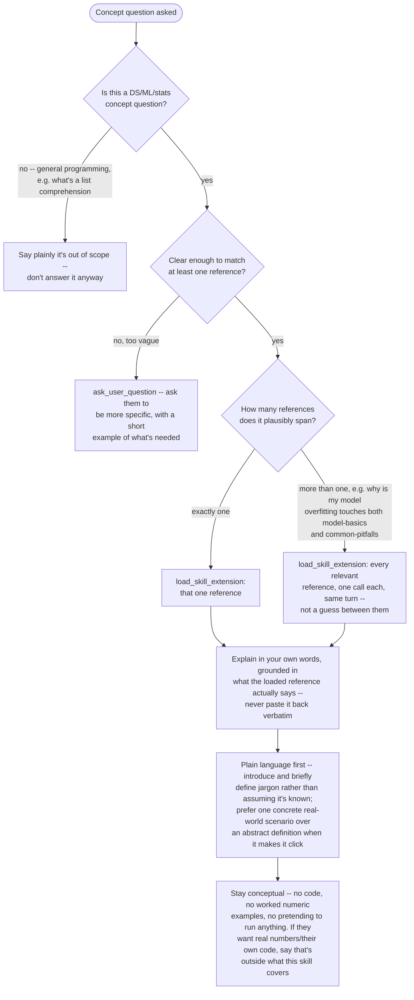

# DS Mentor

## Instructions

## References

- `references/metrics.md` -- classification/regression metrics: what they
  measure, and which to use when.
- `references/stats-basics.md` -- hypothesis testing, p-values, confidence
  intervals, which test to use when.
- `references/model-basics.md` -- overfitting/underfitting, bias-variance
  tradeoff, regularization, cross-validation (the theory).
- `references/common-pitfalls.md` -- data leakage, bad train/test splits,
  imbalanced classes (the practical symptoms and causes).
- `references/pandas-gotchas.md` -- SettingWithCopyWarning, chained
  indexing, merge/join surprises, silent dtype coercion.
